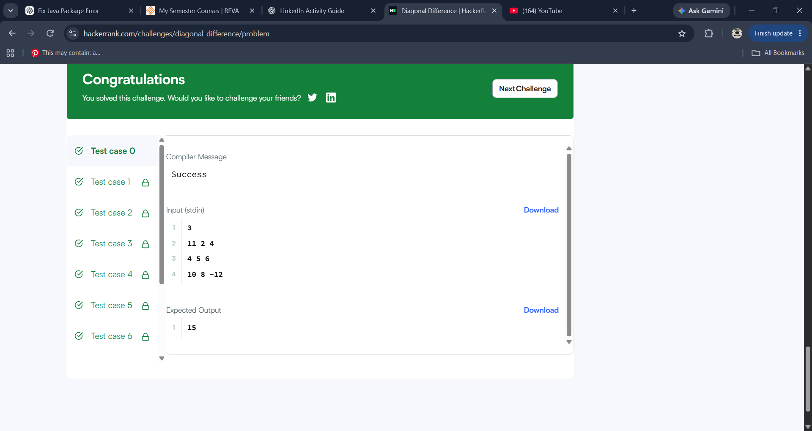
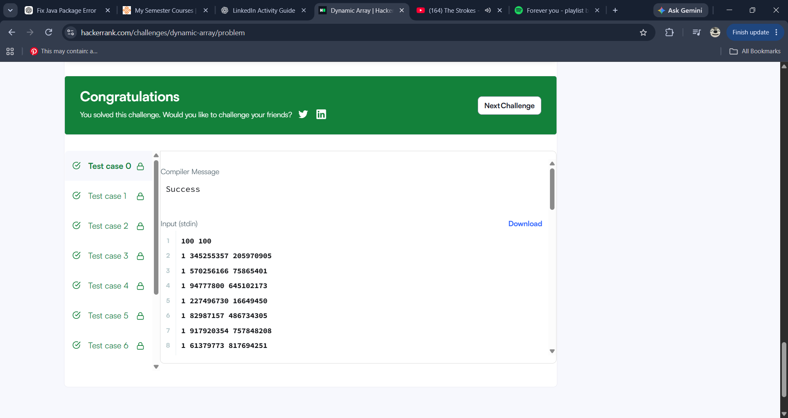
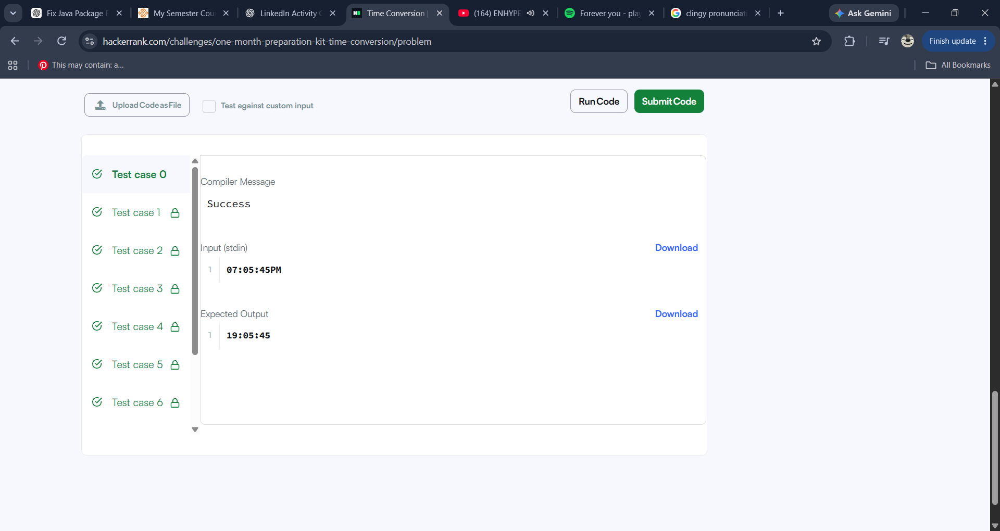
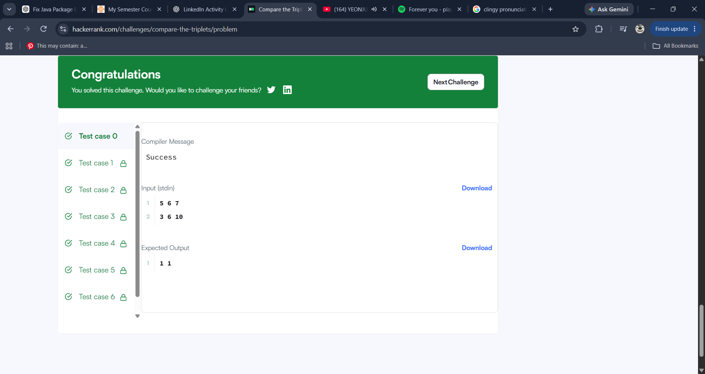
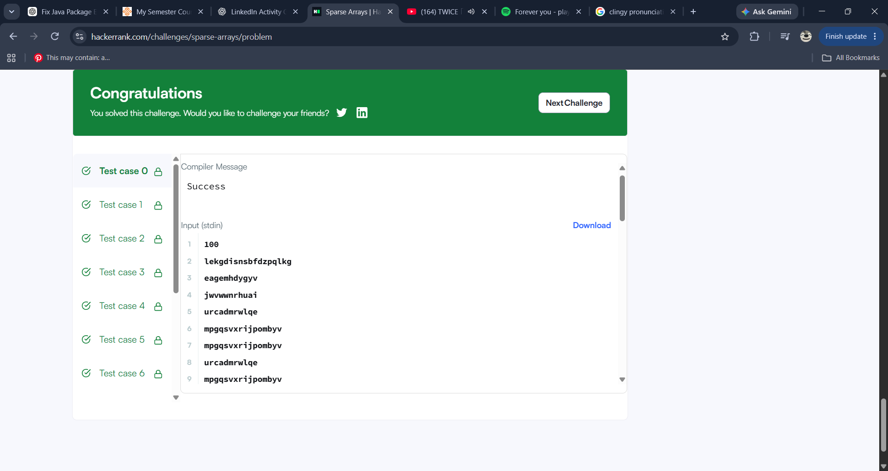

# HackerRank 3rd Semester Portfolio

## About
This repository contains my solutions for the HackerRank algorithmic problem-solving activity.

## HackerRank Profile
[My HackerRank Profile](https://www.hackerrank.com/aishanisejal)

## Problems Solved

| No. | Problem | Topic | Time Complexity | Space Complexity |
|---|---|---|---|---|
| 1 | Diagonal Difference | 2D Arrays / Matrices | O(N) | O(1) |
| 2 | Dynamic Array | Data Structures / Vectors | O(N + Q) | O(N) |
| 3 | Time Conversion | Strings & Logic | O(1) | O(1) |
| 4 | Compare the Triplets | Basic Implementation | O(1) | O(1) |
| 5 | Sparse Arrays | Hash Maps / Strings | O(N + Q) | O(N) |

## Solutions

- [Diagonal Difference](./Diagonal-Difference/)
- [Dynamic Array](./Dynamic-Array/)
- [Time Conversion](./Time-Conversion/)
- [Compare the Triplets](./Compare-the-Triplets/)
- [Sparse Arrays](./Sparse-Arrays/)

## HackerRank Results

All five required problems were successfully submitted on HackerRank.

## Skills Practiced

- C Programming
- Arrays
- Strings
- Data Structures
- Problem Solving
- Time and Space Complexity Analysis

## HackerRank Screenshots

### HackerRank Profile

### Diagonal Difference

### Dynamic Array

### Time Conversion

### Compare the Triplets

### Sparse Arrays

